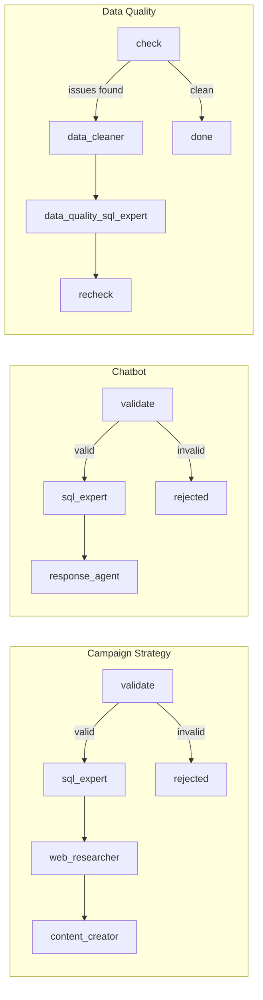

# Marketing Strategist

An agentic marketing assistant that configures itself around **your** data: upload a SQLite
database and a domain config, and every agent: SQL, chatbot, content, image prompt; re-points
itself to your schema and brand. Ships with a sample banking dataset, but isn't tied to one.

## Getting started: bring your own data

The project isn't a fixed demo over one hardcoded dataset — the first real step is telling it what
to run on:

1. Start the backend (see [Running it](#running-it)) with the sample data, or your own `.db` file.
2. Open **Setup** in the UI (`/setup`) or call `POST /setup/upload` with a `.db` file and/or a
   `domain_config.yaml` (brand name, contact info, currency, customer segments).
3. That's it — no restart, no code changes. The SQL agent introspects the new schema live
   (`GET /database/schema` shows exactly what it sees), and every prompt picks up the new brand
   text from the config you uploaded.

From there, the dashboard, chatbot, and campaign generator all operate on whatever you plugged in.

## Demo video

<video controls width="100%" playsinline>
  <source src="./assets/End%20to%20End%20flow.mp4" type="video/mp4" />
</video>

## Why agents (not just a dashboard)

The dashboard (`/get-dashboard-data`, `/get-filtered-data`) is deliberately **rigid**: fixed SQL,
fixed charts — good for known metrics, regardless of which database is active. Everything else is
**agentic**: an agent decides *what* to query, search, or write, and the workflow just sequences
*when* that happens — which is what lets step 2 above work at all. Swap the database or the brand
and the agents adapt automatically instead of needing new prompts or queries hand-written for them.

## Agent framework flow

Each user-facing feature is a small [LangGraph](https://github.com/langchain-ai/langgraph) state
graph — nodes are agents, edges are the workflow:



Agents don't rely on provider function-calling (many free/open-source models don't support it).
Instead they emit plain text — SQL, search queries, prompts — and the workflow node executes it
directly (`execute_sql`, `search_web`, ...). This keeps every agent portable across any
OpenAI-compatible chat model — just change `LLM_BASE_URL`/`LLM_MODEL` in `.env`. Built and tested
against **Meta's Llama-3.1-8B-Instruct served through Hugging Face's Inference Providers router**
(`https://router.huggingface.co/v1`), so it runs on a free API key with no OpenAI billing required;
swapping to OpenAI, another HF-hosted model, or a local Ollama server is a config change, not a
code change.

## Reusability, by design

| Layer | Reusable unit | Lives in |
|---|---|---|
| Prompts | One Jinja template per role, parameterized by domain config — no brand/business text hardcoded in Python | `app/prompts/*.jinja` |
| Agents | One factory function per role (`build_sql_expert_agent()`, ...) — same `SimpleAgent` primitive underneath | `app/agents/` |
| Tools | Plain functions (`execute_sql`, `search_web`, `post_tweet`, `send_campaign_email`) — usable standalone, in a workflow, or in a notebook | `app/tools/` |
| Workflows | LangGraph graphs compose agents + tools for one feature; adding a feature means adding a graph, not touching existing ones | `app/workflows/` |
| Domain | Brand name, contact info, currency, customer segments — swap `domain_config.yaml` to re-skin the whole stack for a different client/vertical | `app/domain_config.yaml` |

Adding a new agent is three small files: a prompt, a `build_x_agent()` in `app/agents/`, and a node
in whichever workflow needs it — no changes to existing agents or routes.

## Features

- **Self-configuring onboarding** — `POST /setup/upload` (or the `/setup` page in the UI) lets you
  drop in your own `.db` file and/or `domain_config.yaml`; the whole agent stack - schema, brand,
  segments — re-points itself immediately, no restart or code change.
- **Campaign strategy generator** - validates the request, pulls DB + web insights, drafts
  marketing copy, and can generate a matching **text-to-image prompt** (one click, copy to
  clipboard) for tools like Midjourney/DALL-E.
- **Chatbot with multi-turn conversation** - the backend is stateless per request; the frontend
  sends the recent message history alongside each new message, and `app/workflows/chatbot.py`
  folds it into the validator/SQL/response agents' prompts so follow-ups (e.g. "what about for
  that segment?") resolve against the prior turn instead of being answered blind. No server-side
  session store needed — the client owns conversation state.
- **Data quality agent** - detects and proposes/applies fixes for data issues per table.
- **Dynamic database** - switch the active `.db` file at runtime; the SQL agent's schema context
  updates automatically (`GET /database/schema` shows exactly what it sees).
- **Caching** - expensive multi-agent workflows are cached in-memory per input (`app/cache.py`, no
  external dependency).

## Running it

```bash
cd Backend
pip install -r requirements.txt
cp .env.example .env   # fill in LLM_API_KEY, LLM_BASE_URL, LLM_MODEL
uvicorn app.main:app --port 5001
```

```bash
cd Frontend
bun install && bun dev
```

Then go to `/setup` and upload your own `.db` + `domain_config.yaml` (or just start using the
sample banking data that ships in `Backend/Database/`).

## Stack

FastAPI · LangGraph · LangChain (OpenAI-compatible LLM client) · SQLite · React (TanStack Router)

Tested LLM provider: **Hugging Face Inference Providers** router, serving **Meta's
Llama-3.1-8B-Instruct** - free-tier friendly and swappable via `.env` for any OpenAI-compatible
endpoint (OpenAI, other HF-hosted models, local Ollama, etc.).
